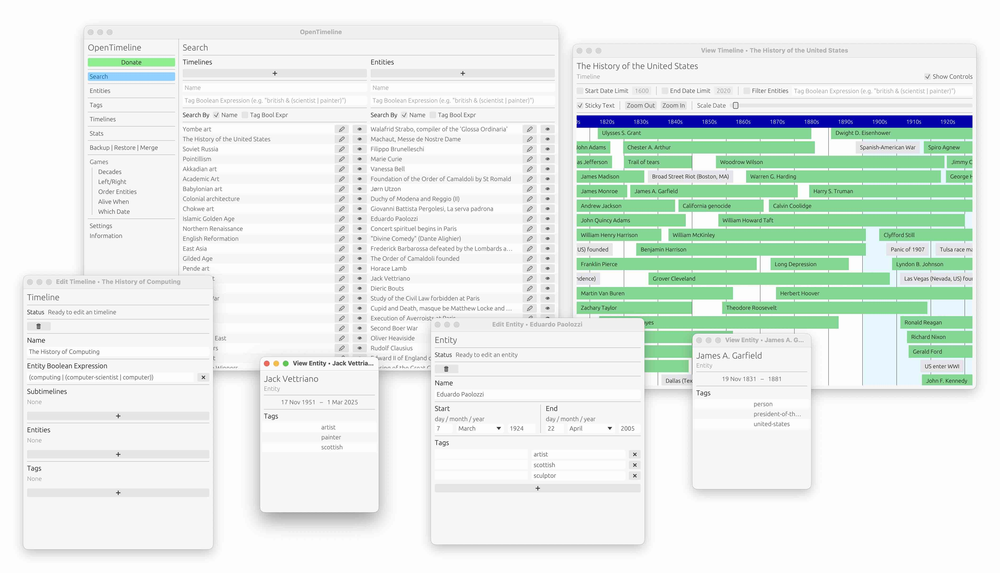
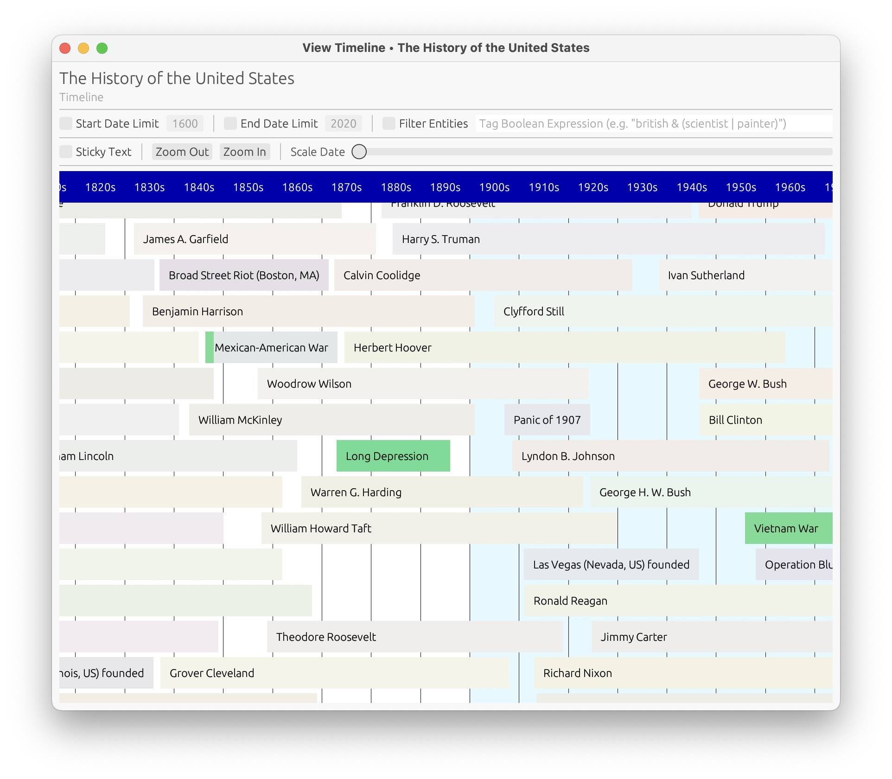

# OpenTimeline

*Dataset: [harryhudson/open-timeline-data](https://github.com/harryhudson/open-timeline-data)*

*Website: [www.open-timeline.org](https://www.open-timeline.org)*

## About

This project exists for 2 reasons:

1. To aid learning and thinking about the past. Humans are bad at perfect recall; when reading history there are too many events and people.  This project aims to leverage the abilities of computers to try and alleviate this problem by providing software for managing, viewing, sharing, and collaborating on timelines.
2. To add context to writings, in particular to online news.  Often when reading the news we forget or don't know the relevant history.  Sometimes a timeline is presented but is very limited, fixed, and not interactive.  We hope this project will plug that gap.


## Usage

Requirements/dependencies:

- `sqlite3`
- `cargo`

Getting started locally should be as easy as:

```sh
# Clone this repo
git clone https://github.com/harryhudson/open-timeline.git
cd open-timeline

# Create the sqlite database file
mkdir crates/crud/db
touch crates/crud/db/timeline.sqlite

# Create the .env file
echo "DATABASE_URL=sqlite:$PWD/crates/crud/db/timeline.sqlite" > .env

# Install `sqlx`
cargo install sqlx-cli

# Setup the database
cd crates/crud
sqlx database setup
cd -

# Build `open-timeline-renderer` for WASM target for rendering timelines on the web
cd crates/renderer
wasm-pack build --target web
cd -

# Build the executable binaries
cd bins
cargo build --release --bin gui
cargo build --release --bin db

# Build the desktop GUI app bundle
cargo-bundle --release --bin gui
```

## GUI Screenshots




