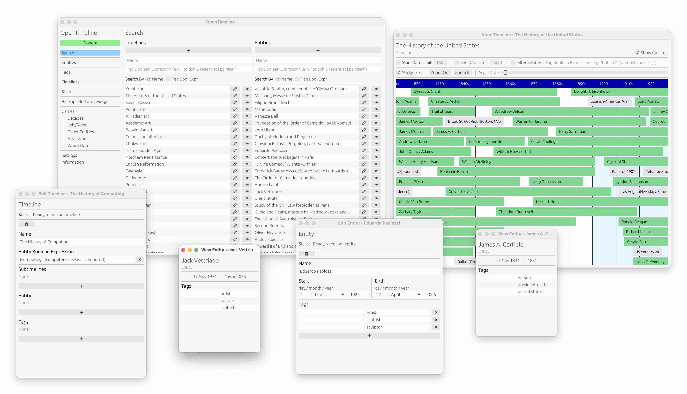
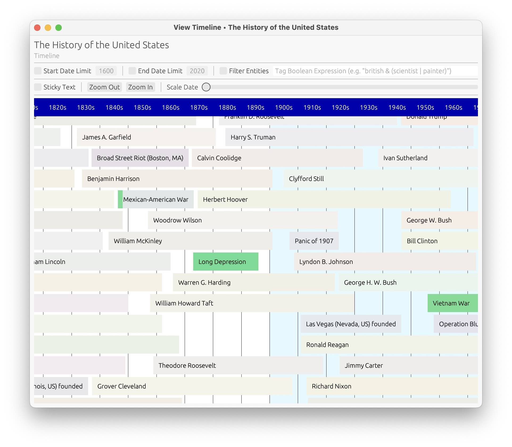
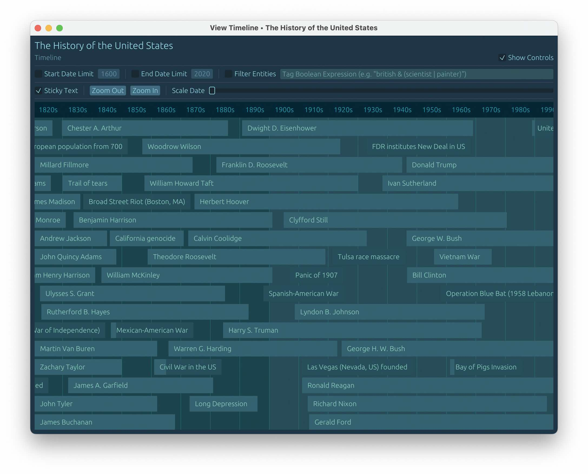

# OpenTimeline

- **Dataset**: [harryhudson/open-timeline-data](https://github.com/harryhudson/open-timeline-data)
    - Open to - and in need of - contributions
- **Website**: [www.open-timeline.org](https://www.open-timeline.org)
    - For a good example of a rendered timeline see [United States](https://www.open-timeline.org/timeline/0b39b2a8-8e04-40f3-a0c6-d2b60f6a8679/view)
- **Crates**:
    - [open-timeline-core](https://crates.io/crates/open-timeline-core)
    - [open-timeline-crud](https://crates.io/crates/open-timeline-crud)
    - [open-timeline-games](https://crates.io/crates/open-timeline-games)
    - [open-timeline-gui](https://crates.io/crates/open-timeline-gui)
    - [open-timeline-gui-core](https://crates.io/crates/open-timeline-gui-core)
    - [open-timeline-macros](https://crates.io/crates/open-timeline-macros)
    - [open-timeline-renderer](https://crates.io/crates/open-timeline-renderer)
    - [open-timeline-www-api](https://crates.io/crates/open-timeline-www-api)
- **Desktop GUI screenshots**: *see bottom*

## About

This repo contains a suite of software for creating, managing, exploring, viewing and sharing timelines and the entities they contain.  It is entirely written in Rust, and nearly all of it has been broken into 8 library crates for re-use by external projects.  These are bundled together into:

- A native desktop GUI application
    - Create & manage entities & timelines
    - Advanced searching using boolean expressions of tags
    - View & explore timelines
    - Play games
    - Backup/merge/restore to & from local JSON files
    - Restore/merge from the [www.open-timeline.org](https://www.open-timeline.org) public API
- A JSON web API server
- A timeline rendering engine and 2 frontends
    - HTML canvas for web rendering - compiled to WASM
    - `egui` painter for native desktop viewing

This project exists for 2 reasons:

1. To aid learning and thinking about the past: Humans are bad at perfect recall; when reading history there are too many events and people.  This project aims to leverage the abilities of computers to try and alleviate this problem.
2. To add context to writings, in particular to online news:  Often when reading the news we forget or don't know the relevant history.  Sometimes a timeline is presented but is very limited, fixed, and not interactive.  I hope this project will plug that gap.

## Usage

Requirements/dependencies:

- `sqlite3`
- `cargo`

Clone the repo:

```sh
git clone https://github.com/harryhudson/open-timeline.git
cd open-timeline
```

### Desktop GUI

Run the app:

```sh
cargo run --release --bin gui
```

Build the app bundle:

```sh
cargo-bundle --release --bin gui
```

### JSON Web API Server

*Before being able to run the JSON web API server, you'll need a database.  The easiest way to do this is by using the GUI application (see above).*

Run the server:

```sh
cargo r --bin www-api -- --database="/path/to/timeline.sqlite" --read-only=true --dynamic=false
```

### WASM OpenTimeline Renderer

Compile `open-timeline-renderer` for the WASM target for rendering timelines on the web:

```sh
cd crates/renderer
wasm-pack build --target web
```

### Other

Should the database schema in the CRUD crate need changing, one can use SQLx to setup a dev database:

```sh
# Create the SQLite database file
mkdir crates/crud/db
touch crates/crud/db/timeline.sqlite

# Create the .env file
echo "DATABASE_URL=sqlite:$PWD/crates/crud/db/timeline.sqlite" > .env

# Install `sqlx`
cargo install sqlx-cli

# Setup the database
cd crates/crud
sqlx database setup
cd -
```

## GUI Screenshots




